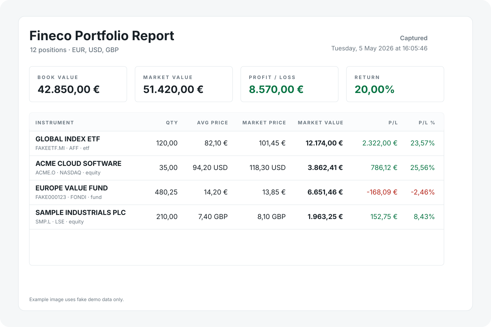

# fineco-helper

A hardened, single self-contained **Rust binary** that exposes an **owner-only
remote MCP** service over read-only Fineco portfolio, market, tax, and order data —
plus a local SQLite history and third-party stock enrichment. It is for one owner;
it is not multi-tenant and has no public surface.

Architecture and operation live under [`docs/`](docs/README.md).



## Privacy & security first

- **Credential isolation.** The internet-facing gateway never holds Fineco
  credentials or cookies, never opens the SQLite DB, and never reaches the live
  socket. A separate credential worker performs the (read-only) Fineco login;
  Fineco session cookies are memory-only, never written to disk.
- **Owner-only.** Remote access is gated by Cloudflare Access (the gateway verifies
  the Access JWT and requires a pinned owner identity); there is no built-in
  multi-tenancy and no anonymous surface.
- **Read-only.** No trading or mutation, ever. Live Fineco refresh is an explicitly
  gated capability (cooldowns + a daily budget); cached reads serve the data.
- **Contained.** Each process runs as its own user under systemd hardening, with
  per-uid nftables egress allowlists, payload-free alerting, and encrypted backups.

## Architecture in one paragraph

One binary, several roles: a **gateway** (the MCP service, loopback-bound behind a
Cloudflare Tunnel), a **store-server** (owns the SQLite snapshot store + the
live-refresh controller), and a **private-worker** (the credential holder that talks
to Fineco). They communicate over isolated Unix sockets. A `cloudflared` tunnel is
the only client of the gateway's loopback bind. See
[`docs/ARCHITECTURE.md`](docs/ARCHITECTURE.md).

## MCP tools (read-only)

Cached reads (instant, from the local store):

- `portfolio_get_freshness`, `portfolio_get_latest_snapshot_summary`,
  `portfolio_get_latest_full_snapshot`, `portfolio_get_latest_shareable_report`
- `portfolio_get_history`, `portfolio_get_allocation_history`,
  `portfolio_get_position_history`
- `orders_get_latest_monitor`
- `tax_get_latest_carry_forward`, `tax_get_latest_minus_by_year`

Public/credential-free market reads (not from the store):

- `market_get_zero_commission_etfs` (the public ETF list),
  `market_get_stock_enrichment` (third-party stock enrichment, parse-not-execute)

Authenticated Fineco market reads (controller-mediated live Fineco login):

- `market_search_asset` (Fineco instrument search by ticker, ISIN, or name;
  implemented as a typed controller path, but intentionally not granted by the
  checked-in deployment policy until the market live-session gate has been
  reviewed clean and the owner intentionally enables it)
- `market_get_asset_details` (Fineco stock/ETF details for a venue-qualified
  identifier, with source-wrapped identity/listing/quote/profile/core
  stock-or-ETF data and explicit heavy holdings/exposures/returns/risk/ratios
  sections; stocks can also request an explicit `external_enrichment` section,
  which is fetched by the credential-free market client after Fineco resolution;
  enrichment-only requests resolve Fineco identity only before that external
  fetch, and the section is source/audit-attributed as `external_enrichment`;
  implemented as a typed controller path, but intentionally not granted by the
  checked-in deployment policy until the market live-session gate has been
  reviewed clean and the owner intentionally enables it)
- `market_get_indices` (Fineco headline indices-bar cards, not a complete index
  universe or venue registry; implemented as a typed controller path, but
  intentionally not granted by the checked-in deployment policy until the market
  live-session gate has been reviewed clean and the owner intentionally enables
  it)

Gated live refresh (a real, rate-limited Fineco login; returns status only — read the
refreshed values via the cached tools afterward):

- `private_portfolio_refresh_live_sensitive`, `private_orders_refresh_live_sensitive`,
  `private_tax_refresh_live_sensitive`

## Run it / deploy it

- **Self-hosting walkthrough:** [`docs/SELF-HOSTING.md`](docs/SELF-HOSTING.md)
- **Deployment (Proxmox LXC) reference:** [`docs/DEPLOYMENT.md`](docs/DEPLOYMENT.md)
- **ChatGPT & Claude connectors:** [`docs/CONNECTORS.md`](docs/CONNECTORS.md) — remote
  MCP over OAuth-via-Cloudflare-Access, with the connector channel scoped to a
  configurable tool allowlist (the absolute-€ detailed-portfolio tools and
  authenticated market reads off by default)
- **Testing + E2E:** [`docs/TESTING.md`](docs/TESTING.md)
- **All docs:** [`docs/README.md`](docs/README.md)

Build + check locally:

```sh
cargo build
cargo nextest run
cargo clippy --all-targets --all-features -- -D warnings
```

## Notes

This is an unofficial helper and is not affiliated with FinecoBank. Use it
responsibly and make sure it fits Fineco's terms and your own security expectations.

## License

Apache-2.0
